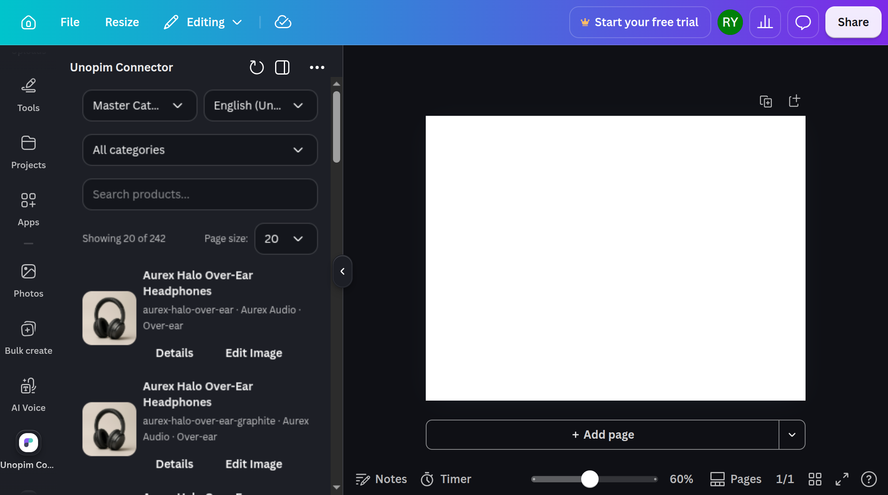
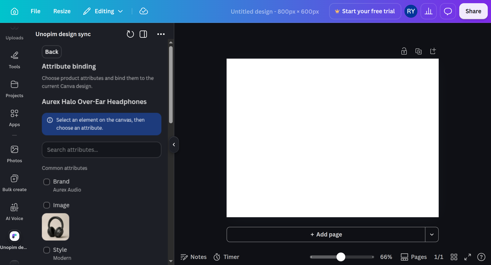
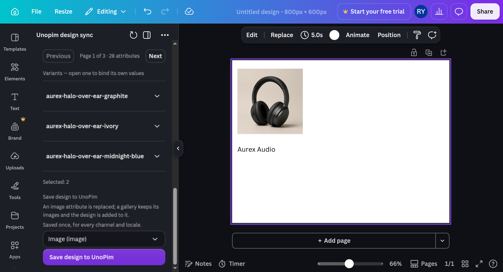

# Using the Canva App

The **UnoPim Connector** app is an object panel that runs beside the Canva canvas. It reads your live catalog, puts product values onto the design, and saves the finished design back onto a product attribute.

> [!NOTE]
> The app has to be created and configured first - see [Connecting Canva](./connecting#part-2-the-canva-app).

## Before you start

Open a design in Canva and launch **UnoPim Connector** from the app list.

Nothing renders until UnoPim confirms the session, so a misconfigured backend is reported **once, up front**, rather than failing screen by screen. The error offers a retry, and it distinguishes *UnoPim is unreachable* from *UnoPim answered with a refusal* by falling back to the unauthenticated health check.

## Step 1 - Find a product

The app opens on the picker.

| Control | Behaviour |
|---|---|
| **Search** | Matches SKU and name. Debounced, so typing does not fire a request per keystroke |
| **Channel** and **locale** | Every value shown from here on is resolved in this scope |
| **Category** | Narrows the list |
| **Page size** | 10, 20 or 50 - 20 by default |

Each row shows a thumbnail, the product name, and `SKU · brand · category`.

  

A filter whose vocabulary fails to load never blocks the picker - the list still works, it just cannot be narrowed by that filter.

> [!TIP]
> Which attribute supplies the row's thumbnail and its title is configurable - see **Product List** in [Settings Reference](./settings).

## Step 2 - Put values on the canvas

Choosing a product opens the binding screen, which lists everything the product can contribute:

| Group | What it holds |
|---|---|
| **Prices** | One entry per currency, each with its own symbol - two currencies bind as two values, not one run-on number |
| **Images to bind** | Every image-bearing attribute, with a thumbnail |
| **Attributes** | Every other resolved attribute, with its label and a readable value |
| **Name · Price · Description** | The product's core fields |
| **Product images** | The product's images, numbered when there is more than one |

**Select** Checkbox puts the value on the canvas in the kind of element it needs - text into a text element, an image into an image element. Realted values are shown by their **option label**.

  

The panel confirms what happened for each add: *added to the canvas*, or *replaced the selected element*.

> [!NOTE]
> An image must be reachable over **HTTPS** for Canva to fetch it. A product image served from a local or plain-HTTP URL cannot be uploaded, so it will not bind.

## Step 3 - Replace an element instead

Select an element on the canvas **first**, then click **Add**.

- If the selected element can hold that kind of value, it is **replaced**.
- If it cannot, a new element is added at the cursor instead.

So a value always lands somewhere, and never in an element that cannot hold it. With nothing selected, the panel simply says so and adds at the cursor - that is not an error.

### When the app asks which element you meant

The Apps SDK gives an element no identifier, so the app finds your selection by **matching its content against a fresh read of the design**. When two elements carry identical content that match is ambiguous, and rather than guessing, the panel lists the candidates as buttons and lets you pick.

### When a replace cannot happen

| Message | Meaning |
|---|---|
| the selected element is no longer in the design | It was deleted or the page changed after you selected it |
| the selected element cannot hold this value | Text into an image frame, or the reverse |
| the selected element is locked in Canva | Unlock it on the canvas and try again |

## Step 4 - Save the design back to UnoPim

At the foot of the binding screen:

1. **Choose the destination.** Only the product's own `image` and `gallery` attributes are offered - read from its attribute family, not from its current values, so a still-empty gallery is a valid destination.

   A product **with variants** is offered only its *common-level* destinations. An attribute the variant structure places at variant level - a gallery held separately per variant, for instance - is held on the variants, so writing it on the parent would reach nothing. Select the variant itself to save into its own.
2. **Check the scope.** The panel states what the save will be written under, matching the channel and locale you are reading in.
3. **Save design to UnoPim.** The button reads **Saving to UnoPim…** and is disabled until the export and upload finish.

  

| Destination | Result |
|---|---|
| `image` attribute | The value is **replaced** |
| `gallery` attribute | The design is **appended**; every image already there is kept |

A scoped attribute is written under the scope you were reading in. An unscoped one stays common whatever scope was selected, so saves to a single common value are never split apart.

### Multi-page designs

A design of several pages exports **one file per page**.

- To a **gallery**: every page is added, in Canva's page order, each as its own image.
- To an **image** attribute: only the **first page** is kept. The attribute holds one file, so the rest have nowhere to go.

## The Edit Image flow

**Edit Image** on a product row goes **straight to the binding screen** for that product. There is no attribute-picking step in between - everything the product can contribute is listed for you, and you bind what you need.

- For a product with variants, the product's own card carries the **common attributes**, and **each variant gets its own card** beneath it, bound to that variant's values.
- There is a **single save block** at the bottom, writing to the product you started from. Variant cards do not each get one.

## If something goes wrong

| Symptom | Cause |
|---|---|
| The panel errors as it opens | Backend Host wrong or unreachable, the connector disabled, or the app's origin blocked by CORS |
| Every call returns 401 | The Canva App ID in UnoPim does not match the Developer Portal |
| Every call returns 403 | The connector's **Enabled** toggle is off |
| Saving says Canva is not connected | The app authenticates with a Canva token, but *saving* needs a Canva account linked in UnoPim to run the export |
| A product has no thumbnail, or is listed by its SKU | A Product List mapping is set and that product has no value for it |

More in [Troubleshooting](./troubleshooting).
