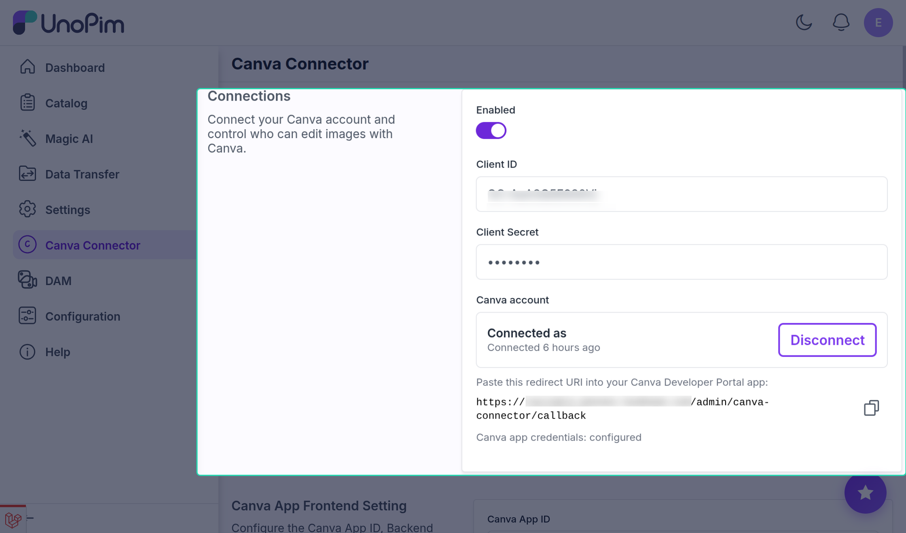
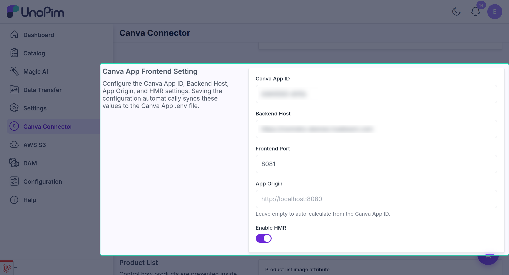
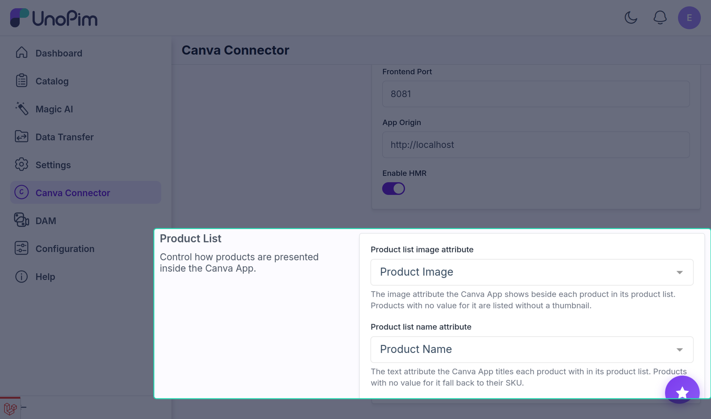

# Connecting Canva

The extension talks to Canva through **two separate applications**, both created in Canva's Developer Portal and both configured on the same UnoPim settings screen. This page sets up each of them.

| | Connect API integration | Canva App |
|---|---|---|
| Gives you | Edit with Canva, and importing designs into a gallery | A catalog panel inside the Canva editor |
| Created as | An **Integration** (Connect API) | An **App** |
| Signs in with | OAuth 2.0 + PKCE - shared credentials, one account per admin user | The Canva user token, verified by UnoPim |
| Canva scopes | Five, all required | None |
| Required? | Yes, for anything in the admin panel | Yes, for the panel inside the Canva editor |

Neither depends on the other, so they are set up in turn: start with [Part 1](#part-1-the-connect-api-integration), then add the app in [Part 2](#part-2-the-canva-app).

## Part 1: The Connect API integration

Everything in the admin panel runs through this. You create it once, enter its credentials into UnoPim, and then each administrator links their own Canva account.

### 1. Create the integration

1. Sign in at the [Canva Developer Portal](https://www.canva.com/developers/).
2. Open **Your integrations** from the portal's navigation.
3. Create an **Integration** of type **Connect API**.
4. Name it. Admins see this name on Canva's consent screen.

### 2. Enable the scopes

All five are required:

| Scope | Without it |
|---|---|
| `asset:write` | Nothing can be uploaded to Canva - no editing at all |
| `asset:read` | Uploaded assets cannot be read back |
| `design:content:write` | Designs cannot be created, and PDFs cannot be imported |
| `design:content:read` | Finished designs cannot be exported back into UnoPim |
| `design:meta:read` | The design picker lists nothing |

> [!WARNING]
> A missing scope surfaces as a **Canva permission error**, not a UnoPim error. Check this list before investigating anything else.

### 3. Register the redirect URI

Canva only returns to a URL registered in advance.

1. Open **Canva Connector** in UnoPim.
2. The screen shows the exact redirect URI for your installation. Copy it verbatim.
3. Paste it into the integration's **Redirect URLs**.



It is derived from your own callback route:

```text
https://your-domain.com/admin/canva-connector/callback
```

`CANVA_REDIRECT_URI` overrides it if you need to force a value.

> [!NOTE]
> The match must be **exact** - scheme, host, port, path, trailing slash. This is the most common setup failure.

### 4. Enter the credentials

Paste the **Client ID** and **Client Secret** into the settings screen, save, and turn **Enabled** on. The secret is stored masked and never shown again.

These credentials are **global**. They are stored once in UnoPim's configuration and shared by every admin user - there is no per-admin copy, and an admin never needs a Canva application of their own. What is per-admin is the account connected against them in the next step.

UnoPim **verifies the pair with Canva as you save**. If Canva rejects them the save is refused and the reason appears under the Client Secret field, so a typo cannot sit unnoticed in your configuration.

Credentials can also come from the environment, as a fallback for deployment pipelines:

```env
CANVA_CLIENT_ID=your-client-id
CANVA_CLIENT_SECRET=your-client-secret
```

Values saved on the settings screen **take precedence** over the environment.

### 5. Connect an account

Each administrator does this once, for themselves, against the shared credentials entered above.

1. Open the settings screen.
2. Click **Connect your Canva account**.
3. Approve the permissions on Canva's consent screen.
4. You return to UnoPim, which now shows the connected Canva user and when the link was made.

The **Edit with Canva** controls appear across the admin panel from this point.

### How the connection is secured

- **OAuth 2.0 Authorization Code flow with PKCE** (`S256`). A random `state` is generated per attempt and the code verifier is stored in the session against it, so a callback cannot be replayed or forged. A callback whose state has no stored verifier is rejected outright.
- **Tokens are encrypted at rest** - `access_token` and `refresh_token` are `encrypted` casts on the model.
- **Refresh is automatic**, five minutes before expiry, on the next request that needs the token. Nobody is asked to reconnect mid-task.
- **Connections are per admin user, credentials are not.** Every admin authorises through the same Canva application, but `canva_connections` is unique on `admin_id` and cascades on delete, so each admin holds their own tokens and removing an admin removes their Canva link with them. Because the tokens were issued by one particular Canva application, replacing the global credentials leaves them unrefreshable: the stored rows remain, but every admin has to reconnect.

### Disconnecting

**Disconnect** on the same screen deletes the stored tokens for your admin user only. Other administrators keep theirs.

### If something is wrong

| Symptom | Cause |
|---|---|
| Canva rejects the redirect URI | It does not exactly match the one on the settings screen |
| **Connect** does nothing | **Enabled** is off, or Client ID / Secret are blank |
| A permission error while editing | A scope was not enabled on the integration |
| The connection stops working later | The refresh token was revoked in Canva - connect again |

## Part 2: The Canva App

The **Canva App** is the half of the extension that runs *inside* Canva: an object panel beside the canvas that reads your UnoPim catalog. It is a separate Developer Portal entry with its own configuration, and it is what the in-editor half of the extension runs on.

Once it is running, [Using the Canva App](./canva-app-usage) covers what it can do.

### How it authenticates

Worth understanding before you configure it, because it explains the settings.

The app is served by Canva, not by UnoPim, so there is no session and no CSRF token to rely on. Each request carries the **Canva user token** as a bearer token. UnoPim verifies that token's signature against **Canva's public key set for your App ID**, then reads the Canva user and team from its claims.

That has two consequences:

- The App ID saved in UnoPim and the one in the Developer Portal must be **identical**, or every request fails verification.
- Canva rotates its signing keys, so the key set is **cached rather than pinned** (`CANVA_APP_JWKS_CACHE_SECONDS`, an hour by default) and refetched once when a signature does not verify.

### 1. Create the app

1. Sign in at the [Canva Developer Portal](https://www.canva.com/developers/).
2. Open **Your apps** from the portal's navigation - not *Your integrations*, which is where Part 1's Connect integration lives.
3. Create an **App** and copy its **App ID**.
4. Under **Intents**, add the **Design editor** intent. This is what makes it open as an object panel inside a design.
5. Under **App source**, set the **Development URL** to your dev server - `http://localhost:8080` unless you change the port below.

**No Canva scopes are needed.** The app calls UnoPim, not Canva's APIs. The portal's **Authentication** section is for apps that sign a user in to a third-party service, which this one does not do.

### 2. Configure it in UnoPim

Open **Canva Connector → Canva App Frontend Setting**:

| Field | Value |
|---|---|
| **Canva App ID** | The App ID from the portal |
| **Backend Host** | Your UnoPim base URL, no trailing slash |
| **Frontend Port** | The dev server's port; blank means `8080` |
| **App Origin** | Leave empty to calculate it from the App ID; set it only for an HMR dev host |
| **Enable HMR** | Development only |



> [!TIP]
> Saving writes these straight into the app's own `.env`, so the app is configured from UnoPim rather than by hand. See [Settings Reference](./settings) for exactly how that file is written.

### 3. Choose what the product list shows

The **Product List** group below decides which attribute supplies each product's thumbnail and title in the app's picker. Both are optional - leave them unset and the app falls back to the first image a product carries and its `name` attribute.



A mapping is exact: a product with no value for the mapped attribute is listed without a thumbnail, or by its SKU. See [Settings Reference](./settings) for the full behaviour.

### 4. Build and run

The source lives in `packages/Webkul/CanvaConnector/canva-app`.

```bash
cd packages/Webkul/CanvaConnector/canva-app
npm install
npm start      # dev server; prints the preview link
npm run build  # dist/app.js, for upload to the portal
```

**Node.js v24** and **npm v11** are required by the Canva toolchain.

> [!WARNING]
> `CANVA_BACKEND_HOST` is **compiled into the bundle**. One build serves one UnoPim installation - you cannot repoint a built bundle by changing configuration afterwards. Rebuild instead.

The preview link `npm start` prints loads the dev server **from your own browser's machine**, so run it where you browse or expose it through a tunnel.

### The API it uses

A stateless JSON API under `/api/canva`, on Laravel's `api` middleware stack - no session, no CSRF, no cookies.

| Endpoint | Purpose |
|---|---|
| `GET /health` | Unauthenticated reachability check |
| `GET /session` | Verifies the token, returns the session and the instance it belongs to |
| `GET /products` | The picker's list |
| `GET /products/{id}` | One product's full contract |
| `GET /products/{id}/attributes` | Bindable attributes, plus valid save destinations |
| `GET /products/{id}/assets` | The product's media |
| `GET /categories`, `GET /channels` | Filter vocabularies |
| `GET /brands` | Brand vocabulary; the API filters by it, though the panel exposes only the category filter today |
| `POST /products/{id}/design` | Saves the current design onto an attribute |

Every endpoint but `/health` sits behind the token middleware.

### What the errors mean

UnoPim names its failures in the response body, so the panel can react to a code rather than parse a message:

| Code | Status | Meaning |
|---|---|---|
| `module_disabled` | 403 | The connector's **Enabled** toggle is off |
| `missing_token` | 401 | No bearer token on the request |
| `invalid_token` | 401 | The token did not verify - usually an App ID mismatch |
| `canva_not_connected` | 409 | No Canva account is linked in UnoPim to save a design with |
| `invalid_design_token` | 401 | The design token did not verify, or belongs to another Canva user |

A token that fails verification is told only that it failed. The reason goes to the log, not to the caller.

### Security notes

- The app's API is **not covered by the extension's ACL keys**. It is gated by the token and by the **Enabled** toggle, so anyone who can open the app under your App ID can read the catalog through it. Treat the App ID as the access boundary. See [Permissions](./permissions).
- A design save additionally checks that the **design token's Canva user matches the session's**, so a token captured elsewhere cannot be used to write into your catalog.
- Save destinations are checked against **the product's own attribute family**, so a hand-made request cannot write a design onto an attribute the product does not carry.

## More help

[Troubleshooting](./troubleshooting) covers both halves in more detail.
