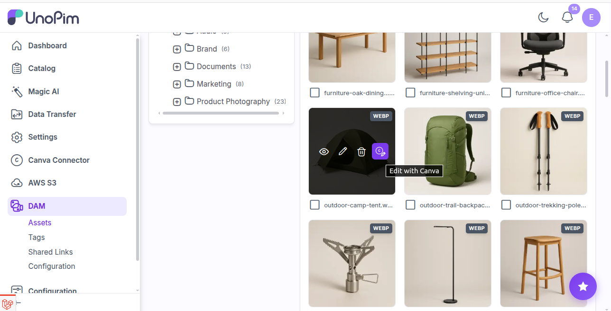
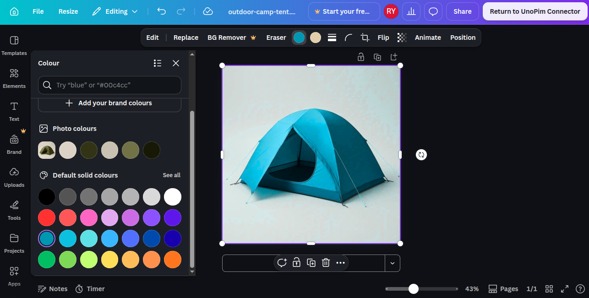
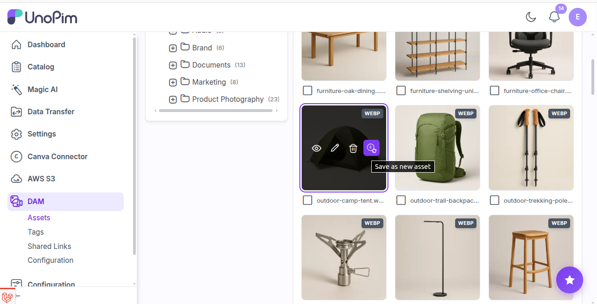
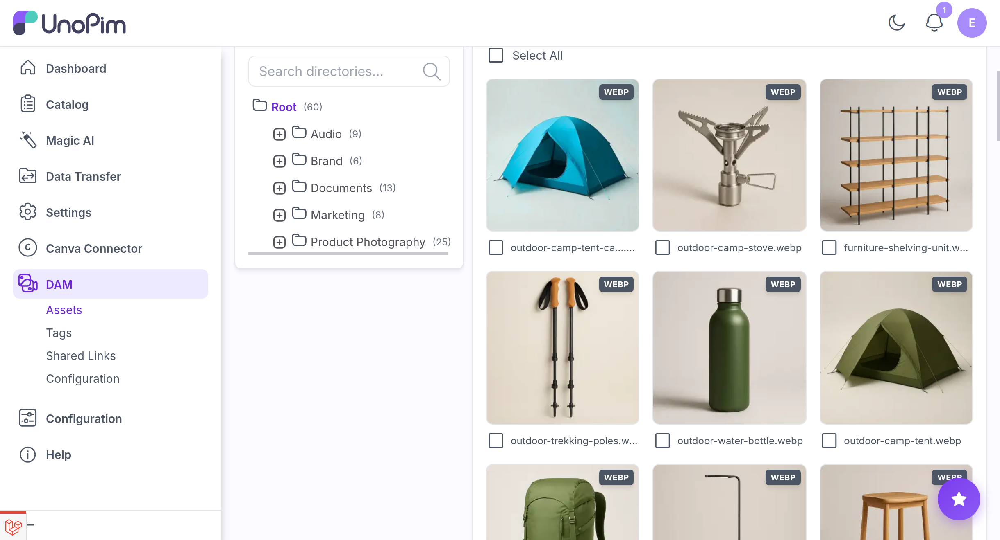

# Editing a DAM Asset

Assets in the UnoPim **DAM** open in Canva straight from the grid. The result is always saved as a **new asset** - the original is never touched.

> [!NOTE]
> Requires the UnoPim **DAM** package.

## Where the control appears

Listening on `dam.admin.main.form.grid.after`, the extension adds an icon to each grid card's hover row, beside the existing actions.

The DAM card component exposes no asset id in the DOM, so the extension indexes `{path → record}` from the grid's own datagrid responses and matches each card by its image source. A card it cannot identify simply gets no icon.

## What is eligible

| Asset | Editable | How |
|---|---|---|
| Any asset classified `image` | Yes | Uploaded to Canva; a design is created at the source's dimensions |
| `.pdf` documents | Yes | Sent through Canva's **Design Import API** - it becomes a fully editable design, not a flat picture |

Ineligible assets never show the icon.

## The round trip

### 1. Open

Click the icon. The design opens in a new tab.

<div align="center">
  
</div>

### 2. Edit

Work in Canva and leave the design saved.

<div align="center">
  
</div>

### 3. Save as a new asset

Back in the grid, the card now shows that it has work open in Canva:

- the icon changes from the **image** glyph to the **sync** glyph,
- the card is **outlined** so you can pick it out among hundreds, and
- the icon's tooltip reads **Save as new asset**.

<div align="center">
  
</div>

That state is remembered per asset, so it survives scrolling, changing folder, and navigating away and back.

Clicking it exports the design and creates a new asset **in the same folder as the original**. The grid refreshes in place rather than reloading, so you stay in the folder you were in.

<div align="center">
  
</div>

## Naming

```text
{original}-canva-{timestamp}.{ext}
```

`hero.png` becomes `hero-canva-20260903142530.png`.

| Case | Behaviour |
|---|---|
| Editing the same asset repeatedly | The suffix **does not stack** - any existing `-canva-{timestamp}` is stripped before the new one is added, so you never get `hero-canva-…-canva-…` |
| Two saves inside one second | The next becomes `…-2.png`, then `…-3.png`, because DAM paths must be unique |
| A name over Canva's 50-character limit | Trimmed automatically on upload, extension preserved |

## Starting clean

After a successful save the design link for that asset is **cleared**. The next edit of the original therefore starts from a fresh copy of the original, not from your last edit. To keep iterating, edit the new asset instead.

## Format and classification

The new asset keeps the original's format where Canva can produce it, and is re-encoded locally where it cannot. Its MIME type and DAM file-type classification are derived from the final extension, so it lands in the right filters. See [File Formats](./file-formats).

It is created through the DAM's own upload finalisation - thumbnails, directory attachment, classification - so it behaves exactly like a manually uploaded asset.

## Permission

`dam.asset.canva_connector.edit`.
