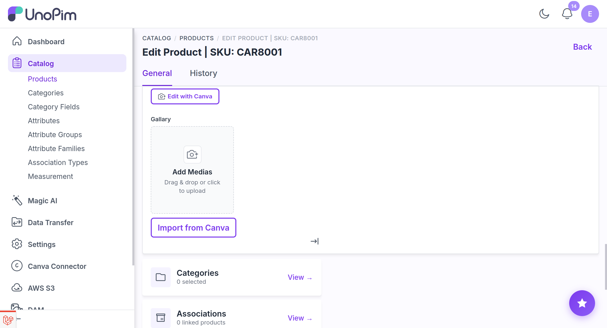
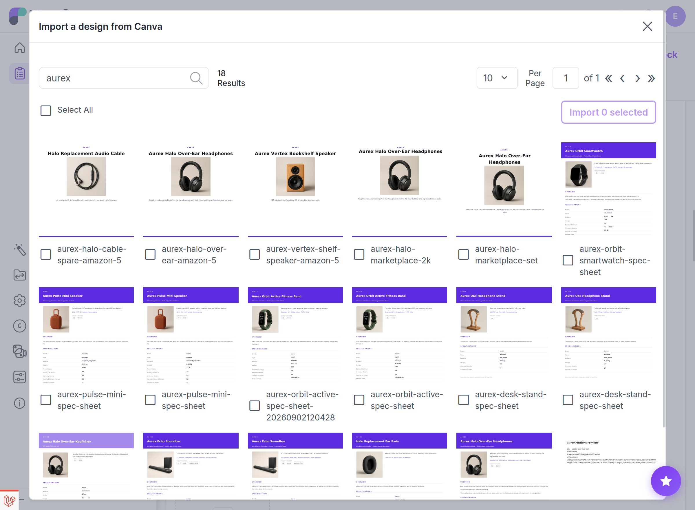
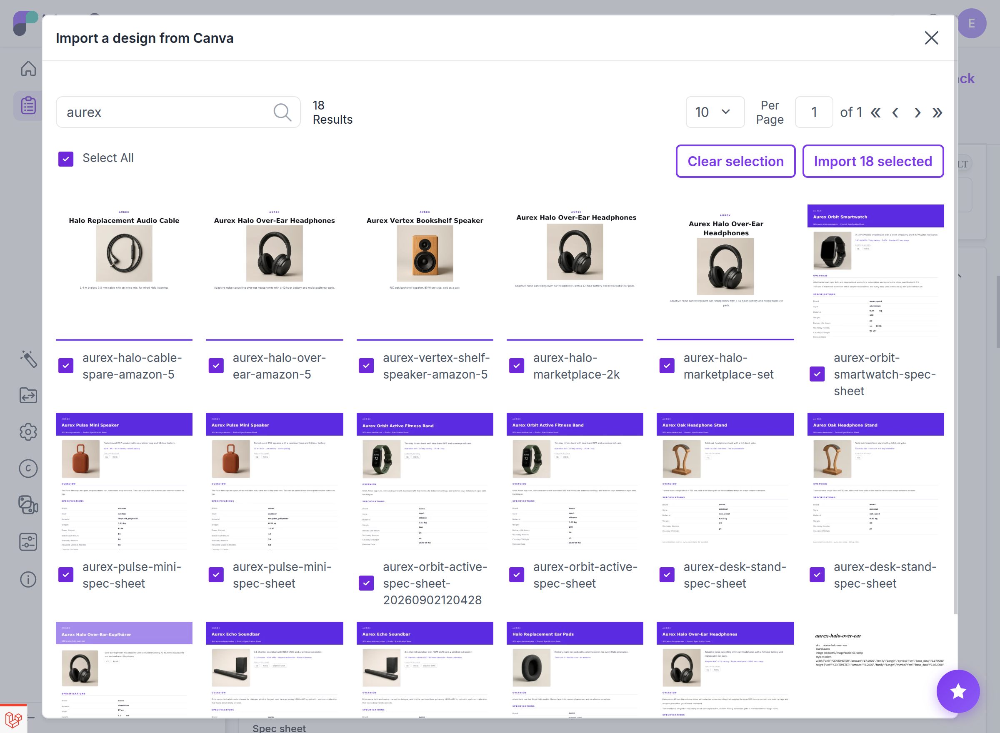

# Importing Designs into a Gallery

Rather than editing an image you already have, you can pull designs that **already exist in your Canva account** into a `gallery` attribute.

## Opening the picker

**Import from Canva** sits beside the gallery's **Add Media** tile. It opens a modal listing your Canva designs with thumbnails.

  

> [!NOTE]
> Thumbnails are re-fetched every time the picker opens, because Canva's thumbnail links are short-lived signed URLs. A cached list would show broken images.

## Finding designs

- **Search** filters by design title, matching a **case-insensitive substring** - `hero` finds *Summer Hero Banner*.
- Single-character searches are ignored, since they would match most of an account.
- Results **page as you scroll**, following Canva's continuation tokens, so a large account is not loaded at once.

  

## Selecting and importing

Tick any number of designs. **Multi-select is kept as you search and page**, so you can assemble a batch from several searches.

  

**Import** exports the selection from Canva **in parallel, capped at four at a time**. A batch therefore takes roughly as long as its slowest design rather than the sum of them all, without flooding your workers.

Imported images arrive as **normal pending uploads** on the form. Nothing is written to disk until you save the product - exactly like dragging files in by hand.

## Multi-page designs

A multi-page design imports **one gallery image per page**, in order. A five-page design arrives as five gallery items, so a set of listing images built in Canva can be pulled into a product's gallery in one go.

## Format negotiation

The export format is negotiated against **the attribute's own allowed extensions** *before* anything is downloaded, so an imported file cannot be rejected by the gallery's validation after the fact.

If nothing in the intersection is acceptable, that design is skipped rather than imported in a format the field would refuse.

## Ownership

Only designs in **your own** Canva account are listed. Designs shared with you, or owned by a team you do not belong to, do not appear.

## Permission

`catalog.products.canva_connector.edit_gallery`.

