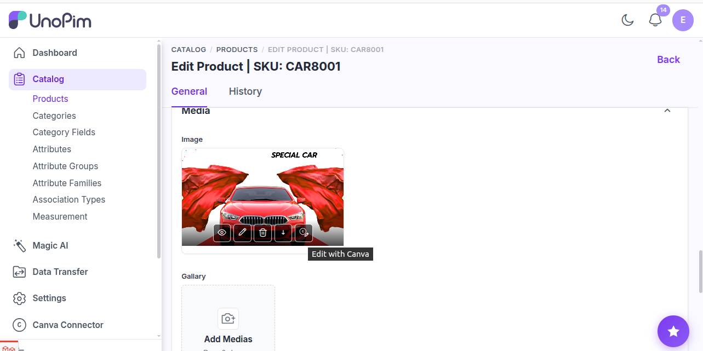
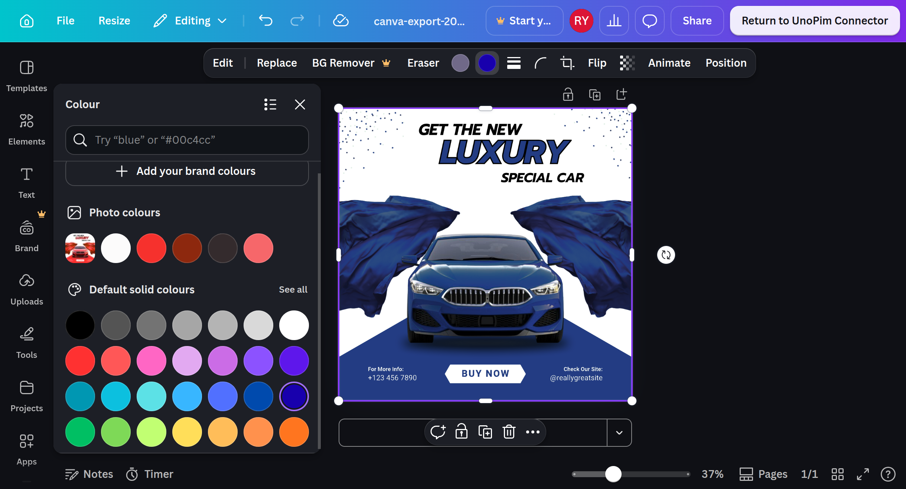
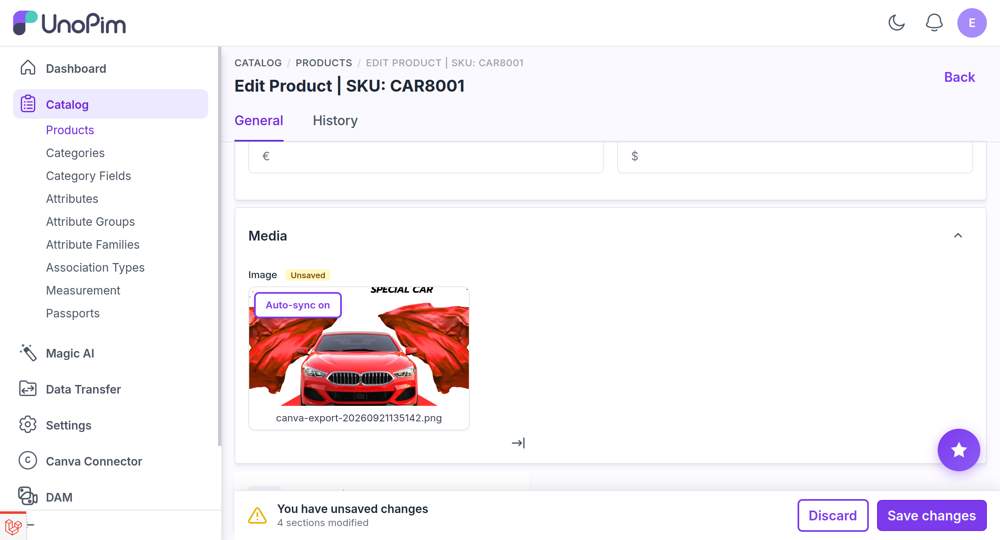
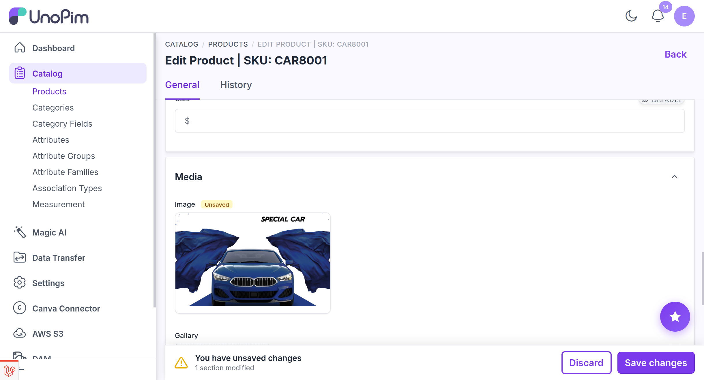

# Editing a Product Image

An `image`-type attribute holds a single file. The connector opens it in Canva and writes the finished design back over the same value.

## Where the control appears

The extension listens on `unopim.admin.media.image.after`, so every rendered `image` attribute gains a control - with no change to the product form itself. You get two, and they do the same thing:

- a **button** under the media control, and
- an **icon** in the media card's hover row, beside view / replace / delete.

Hovering either names what it will do: **Edit with Canva**, or **Sync from Canva** when Canva holds work the field has not been given yet.

Nothing is rendered when:

| Condition | Why |
|---|---|
| The connector is disabled | The master toggle gates every control |
| The role lacks `catalog.products.canva_connector.edit_image` | Checked in the view *and* on the endpoint |
| The field is locked or read-only | The control looks for the field's file input; without one, only the label renders |
| You are on the product **create** form | There is no product id yet to attach a design to |

## The round trip

### 1. Open it in Canva

**Edit with Canva** uploads the current file to Canva, creates a design **at the image's real pixel dimensions**, and opens it in a new tab. Nothing is cropped or scaled to fit a template.

With **no image on the field yet**, the button instead opens a blank design at `design.default_width` × `design.default_height` - 1080 × 1080 out of the box - so a product image can be made from nothing.

The moment the design is created the connector exports it once and remembers what that export looked like. That untouched snapshot is the line every later "has anything changed?" is measured against - see [How a change is detected](#how-a-change-is-detected).

<div align="center">
  
</div>

### 2. Edit

Work in the Canva tab. There is no export or download step; leave the design saved in Canva and come back.

<div align="center">
  
</div>

### 3. Auto-sync, until you save the product

While the product form is still open and **unsaved**, the card carries an **Auto-sync on** badge and the connector pulls your saved Canva changes in by itself, every 10 seconds. You can stay in Canva and watch the product image keep up.

Auto-sync stops the moment you **save the product**. That is deliberate: once the value is committed, nothing should overwrite it behind your back.

<div align="center">
  
</div>

### 4. Sync needed, after that

With auto-sync off, the connector keeps *watching* rather than pulling. It checks every 10 seconds, and again whenever you return to the browser tab. When Canva really does hold newer work, the card raises **Sync needed** and the action switches to **Sync from Canva**.

Clicking it exports the design and **overwrites the attribute value in place**, in the same attribute, channel and locale.

The card is updated in the DOM rather than by reloading, so other unsaved edits on the product form survive the sync. The picture, the file name under the card, the name in the preview (eye icon) and the download link all move to the synced file straight away.

<div align="center">
  
</div>

Once the sync lands, the action goes back to **Edit with Canva**, and the cycle can run again:

```text
Edit with Canva → edit in Canva → Sync needed → Sync from Canva → Edit with Canva → …
```

## Card badges

| Badge | When |
|---|---|
| **Auto-sync on** | A design is open and the product has not been saved since; changes are pulled every 10 seconds |
| **Syncing…** | An export is in flight |
| **Synced** | Shown for five seconds after a successful sync |
| **Sync needed** | Canva holds work this field does not have; click the control to pull it in |
| *(no badge)* | A design is open but Canva holds nothing new |

## How a change is detected

Canva's own "last saved" timestamp moves for more than your edits - opening the editor autosaves, and exporting touches the design too. Treating that timestamp as the answer made **Sync needed** appear after a look that changed nothing.

So the timestamp is only the cheap first question. When it has moved, the connector exports the design and compares that picture with the bytes the field already holds:

| Outcome | Result |
|---|---|
| The export differs | **Sync needed** |
| The export is identical | No badge. The connector carries the new timestamp forward, so the same non-edit is not re-checked on every poll |
| Canva cannot be reached | No badge; the field is left alone |

A design created before this behaviour existed has no snapshot to compare against. It stays quiet until its next sync records one.

The same comparison guards the sync itself: a **Sync from Canva** that would write the picture the field already has is refused with *"Canva has not saved your changes yet"* rather than storing a pointless copy.

## File naming

The synced file keeps the **original image's name**. Rename the design in Canva and the new name is used instead - `Autumn Hero` becomes `Autumn-Hero.png`. Names are cleaned to `A-Za-z0-9._-`, capped at 100 characters, and the extension always follows the file actually written.

A blank design that was never renamed in Canva falls back to `canva-export-{timestamp}.png`.

## Discarding a sync

A sync writes to the product immediately, so it also raises UnoPim's unsaved-changes bar. **Discard** undoes it properly:

- the original file is written back onto the attribute,
- the card returns to that image, and
- the design is **detached** from the field.

The next **Edit with Canva** therefore starts a fresh design from the restored image, not from the edits you discarded. Those edits still exist in your Canva account if you want them - import the design instead. See [Importing Designs](./importing-designs).

## Scope and inheritance

The design key includes the channel and locale, so each scope is tracked separately. An attribute defined as `common`, `channel_specific`, `locale_specific` or `channel_locale_specific` gets **one design per value** - editing the `en_US` image cannot disturb the `fr_FR` one.

A value a **variant inherits from its parent** is editable: the current value is read through UnoPim's resolved-value chain, so the parent's image is what opens. On sync the edited copy is written as the **variant's own** value, and the parent is untouched.

## Format

A single `image` sync always returns **PNG**. Original-format preservation applies to galleries and DAM assets, not here - see [File Formats](./file-formats).

## Permission

`catalog.products.canva_connector.edit_image`, enforced in the view and on every endpoint.
