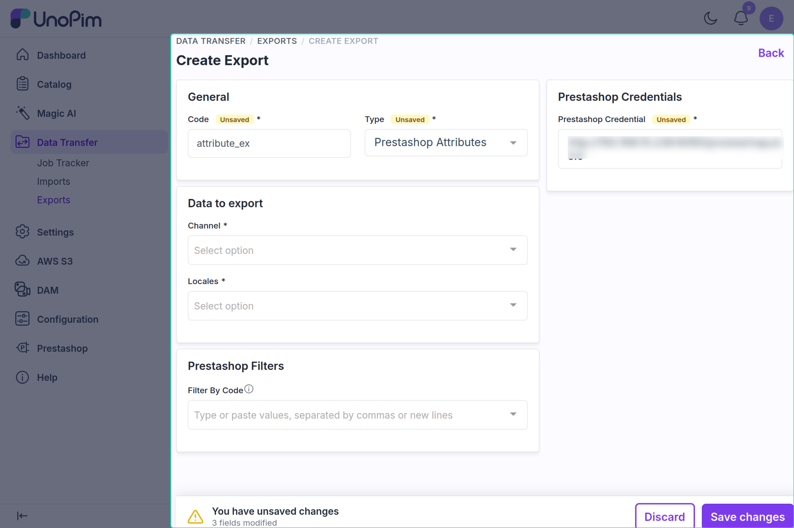

# Attribute Export

The attribute export job pushes UnoPim attributes to PrestaShop. Depending on how the attribute is configured in the **Other Mapping** tab, it exports as either a **Feature** or a **Product Option** (used for combinations).

---

## How to Run

1. Go to **Data Transfer → Exports → Create Export**.


2. Select type **Prestashop Attributes**.



3. Set the filters:

| Filter | What to pick |
|---|---|
| **Prestashop Credential** | Your PrestaShop connection — required |
| **Channel** | One or more channels mapped in the credential's Shop Mapping — required |
| **Locales** | The locales to export — required |
| **Filter By Code** | Optional. Export only the mapped attributes whose code is listed here; leave empty to export all mapped attributes |

4. Save and run the job.


---

## Two Types of Attributes

| Type | Where configured | What it becomes in PrestaShop |
|---|---|---|
| **Feature** | Other Mapping → *Attributes to be used as feature attribute (For Export)* | A product feature (e.g. "Material: Cotton") |
| **Variant** | Other Mapping → *Attributes to be used for variant (For Export)* | A product option used in combinations (e.g. "Color", "Size") |

Only attributes selected in one of these two lists are exported. If neither list has attributes, the job log reports that no attributes are mapped for export.

---

## What Gets Exported

For each attribute:

- **Attribute name** — localized per mapped PrestaShop language
- **All attribute options** — each option's label is also localized

---

## Create vs Update

| Situation | What happens |
|---|---|
| Attribute not in PrestaShop yet | **Created**; its PrestaShop ID is saved |
| Attribute already exported | **Updated** |
| Option not in PrestaShop yet | **Created** and linked to its parent attribute |
| Option already exported | **Updated** |

---

## Localization

Attribute names and option labels are sent once per PrestaShop language, using the locale mappings from the credential's **Shop Mapping**.

If a locale has no label, the attribute or option code is used.

---

## Example

UnoPim attribute `material` (Feature) with options: Cotton, Wool.

PrestaShop receives:
```
Feature: Material
  Feature Value: Cotton
  Feature Value: Wool
```

UnoPim attribute `size` (Variant) with options: S, M, L.

PrestaShop receives:
```
Product Option: Size
  Option Value: S
  Option Value: M
  Option Value: L
```

---

## Common Issues

| Issue | Fix |
|---|---|
| Attribute not exported | Add it to the feature or variant list in the Other Mapping tab |
| Attribute missing from the feature/variant list | Only select-type attributes can be chosen |
| Names are blank | Make sure the selected locales have label values in UnoPim |
| Export fails at startup | Verify the credential is enabled and its Shop Mapping is complete |
