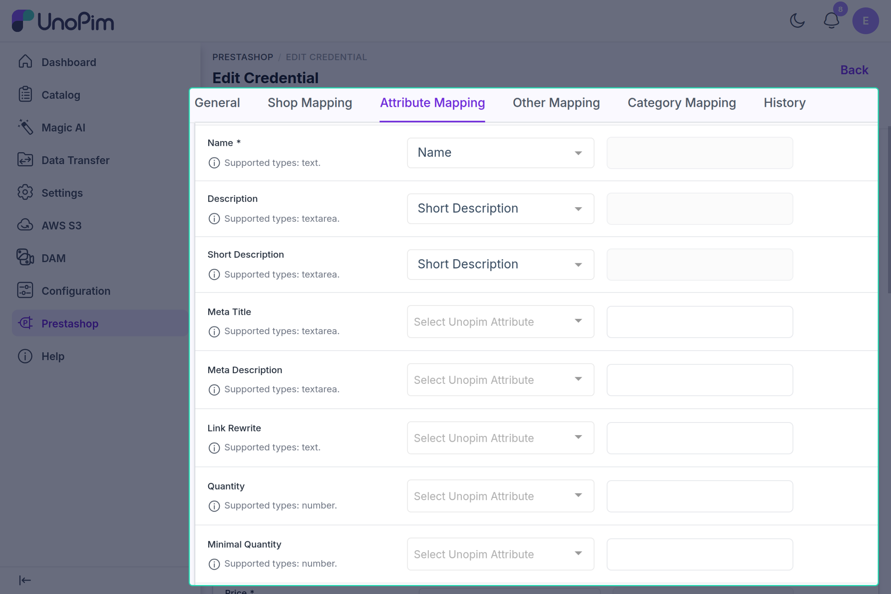
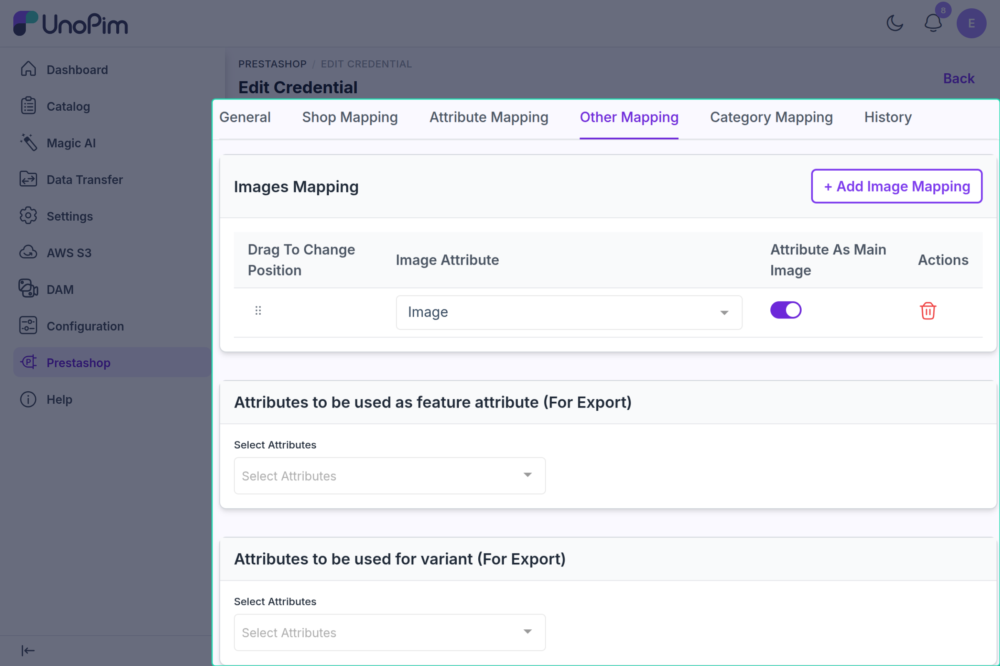

# Attribute Mapping

Attribute mapping tells the connector which UnoPim attribute fills which PrestaShop product field. Product export jobs cannot be saved or run until it is configured.

---

## Where to Configure

Go to **Prestashop**, open a credential, and use the **Attribute Mapping** and **Other Mapping** tabs.

| Tab | What you configure |
|---|---|
| **Attribute Mapping** | Map UnoPim attributes or default values to PrestaShop's product fields |
| **Other Mapping** | Image attributes, feature attributes, and variant attributes |

> These mappings are shared by all credentials. Changing them on one credential changes them for every credential.

Save either tab with **Save changes** in the bar at the bottom of the page.

---

## Attribute Mapping Tab

Each row maps one PrestaShop field, with three columns: **Prestashop Field**, **Unopim Attribute**, and **Default Value**. The field label is followed by its PrestaShop field code, e.g. **Name** `[name]`, and a hint line lists the supported attribute types.

### Attribute or Default Value

For each field, fill in **either** an attribute **or** a default value:

- Selecting a **Unopim Attribute** disables the Default Value input.
- Entering a **Default Value** disables the attribute select.
- The default value is used only when no attribute is mapped. It is sent as the same fixed value for every product.

**Name** and **Price** are required: each needs an attribute or a default value. Saving without them fails with *"Required mappings are missing for: name, price."*

### Standard Fields

Only attributes of a supported type are offered for each field:

| Supported type | PrestaShop fields |
|---|---|
| text | Reference, Name, Link Rewrite, Upc |
| number | Isbn, Ean13, Quantity, Minimal Quantity, Width, Height, Depth |
| textarea | Description, Short Description, Meta Title, Meta Description |
| price | Price, Wholesale Price, Price2, Unit Price Impact, Additional Shipping Cost |
| select | Id Tax Rules Group, Condition, Visibility |
| boolean | Active, Show Condition, Available For Order |
| decimal | Weight |
| date | Available Date |

For **number** and **decimal** fields the list shows attributes whose validation is set to number or decimal.

**Fields sent by product export:** Name, Description, Short Description, Meta Title, Meta Description, Link Rewrite, Price, Reference, Ean13, Upc, Weight, Visibility, Active, Id Tax Rules Group, and Quantity — plus `mpn` when added under Extra Mappings. The other standard fields and Extra Mappings are saved but are not currently sent to PrestaShop.

### Extra Mappings

The **Extra Mappings** section adds PrestaShop fields that are not in the standard list. Type the **Prestashop field code** and click **Add**. Codes may contain only letters, numbers, and underscores, up to 255 characters. An added field accepts any attribute type, has its own default value, and can be removed with its delete icon. For example, add `mpn` to export the manufacturer part number.

---

## Other Mapping Tab

### Images Mapping

Click **+ Add Image Mapping** to add a row, and select an **Image Attribute** (attributes of type image, gallery, or asset). Turn on **Attribute As Main Image** for the row that holds the cover image — only one row can be the main image. The other rows become additional images. Drag rows to change their order.

### Feature Attributes

**Attributes to be used as feature attribute (For Export)** — select attributes that should export as **PrestaShop Features** (e.g. "Material: Cotton"). Only select-type attributes are listed.

### Variant Attributes

**Attributes to be used for variant (For Export)** — select attributes that should export as **PrestaShop product options**, used to build combinations (e.g. Color, Size). Only select-type attributes are listed.

Feature and variant attributes are exported by the [Attribute Export](./attribute-export.md) job, which must run before products that use them.

---

## How It Works During Export

When a product export job runs:

1. The connector loads the attribute mapping.
2. For each field, it reads the mapped attribute's value for the job's channel and locales, or uses the default value if no attribute is mapped.
3. Fields with neither an attribute nor a default are not sent — no other attributes are exported automatically.
4. Localized fields (name, descriptions, meta fields, link rewrite) are sent per mapped PrestaShop language.
5. Feature attribute values are attached to the product as PrestaShop features.

---

## Example

You map UnoPim attribute `sale_price` to **Price** and enter `1` as the default value of **Active**.

For each product the connector sends `sale_price` as the PrestaShop price, and every product is exported as active.

---

## Common Issues

| Issue | Fix |
|---|---|
| *"The Attribute Mappings are not set…"* when saving a product export job | Map an attribute or default value for **Name** and **Price** |
| Product skipped with *"Product price is required field."* | The product has no value for the mapped price attribute — fill it, or use a default value |
| Attribute missing from a field's dropdown | Its type does not match the field's supported types |
| Feature values not appearing | Add the attribute to **Feature Attributes** and run Attribute Export |
| Images not syncing | Add the image attribute under **Images Mapping** |
