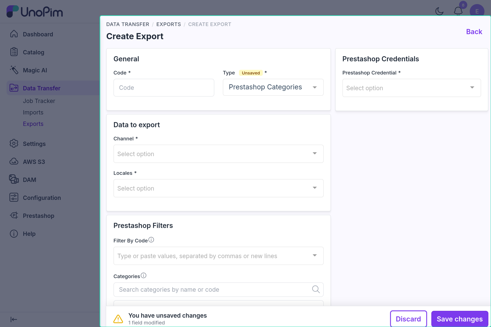

# Category Export

The category export job pushes UnoPim categories to PrestaShop, keeping the same parent-child hierarchy. Which fields are sent is controlled by the [Category Mapping](./category-mapping.md).

---

## Before You Start

- Complete the credential's [Shop Mapping](./shop-channel-mapping.md).
- Map at least **Name** in the [Category Mapping](./category-mapping.md) tab. Without it the job cannot be saved: *"The Category Mappings are not set. Please map the category fields in the Category Mapping tab of the credential first."*

---

## How to Run

1. Go to **Data Transfer → Exports → Create Export**.


2. Select type **Prestashop Categories**.



3. Set the filters:

| Filter | What to pick |
|---|---|
| **Prestashop Credential** | Your PrestaShop connection (only enabled credentials are listed) — required |
| **Channel** | One or more channels mapped in the credential's Shop Mapping — required |
| **Locales** | The locales to export, from those mapped for the selected channel — required |
| **Filter By Code** | Optional. Export only the categories whose code is listed here; leave empty to export all |
| **Categories** | Optional. Pick categories from the tree; selected categories are exported along with their parent categories |

4. Save and run the job.


---

## What Gets Exported

For each category except the UnoPim `root`, the connector sends the fields set in the Category Mapping:

- **Name, Link Rewrite, Description, Additional Description, Meta Title, Meta Description** — localized per mapped PrestaShop language
- **Active** status
- **Image** — the category image, if mapped
- **Parent category** — resolved automatically so the PrestaShop hierarchy matches UnoPim

If Name has no value, the category code is used; if Link Rewrite has no value, a slug of the name is used. See [Category Mapping](./category-mapping.md) for the full rules.


---

## Create vs Update

| Situation | What happens |
|---|---|
| Category exported before | **Updated** using the saved PrestaShop ID |
| Not exported before, but a PrestaShop category has `link_rewrite` equal to the UnoPim code | That category is **updated** and linked |
| No match found | Category is **created**; its new ID is saved |
| Saved ID no longer exists in PrestaShop | Category is **recreated** and the saved ID refreshed |

New categories are created in the first shop mapped to the selected channel. Other mapped shops receive the localized values for the categories that already exist.

---

## Parent-Child Hierarchy

Categories are always sent parents first:

1. Top-level UnoPim categories are placed under PrestaShop's **Home** category.
2. Each child is sent after its parent, with the parent's PrestaShop ID already set.
3. When you filter by code or category, the parents of the selected categories are added automatically so the tree stays complete.

If a parent cannot be resolved, the child is skipped with a warning in the job log instead of being attached to the wrong place.

---

## Example

UnoPim tree:
```
Electronics (parent)
  └── Phones (child)
        └── Smartphones (grandchild)
```

PrestaShop receives them in order: **Electronics → Phones → Smartphones**, each with its parent ID already set. Exporting only `smartphones` with **Filter By Code** also sends Electronics and Phones.

---

## Common Issues

| Issue | Fix |
|---|---|
| Category job cannot be saved | Map **Name** in the Category Mapping tab |
| Category names are blank or show the code | Map **Name** and make sure the selected locales have values |
| Category image not exported | Map **Image** in the Category Mapping tab |
| Child category skipped | Check the job log — its parent could not be exported |
| *"The Prestashop Credential is not active."* | Enable the credential in its General tab |
