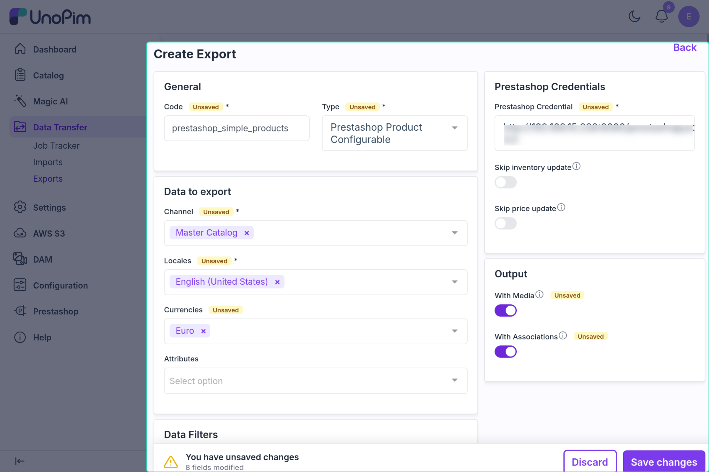

# Configurable Product Export

The configurable product export job pushes UnoPim configurable products to PrestaShop. In PrestaShop these become **products with combinations** — a parent product that holds the shared data, with each UnoPim variant as a combination underneath it. The parent and all of its variants are exported in the same job.

---

## Before You Start

- Map **Name** and **Price** in the [Attribute Mapping](./attribute-mapping.md) tab — the job cannot be saved without them.
- Add the variant-defining attributes (e.g. Color, Size) to *Attributes to be used for variant (For Export)* in the **Other Mapping** tab.
- Run [Attribute Export](./attribute-export.md) and [Category Export](./category-export.md) first.

---

## How to Run

1. Go to **Data Transfer → Exports → Create Export**.

2. Select type **Prestashop Product Configurable**.

3. Set the filters. They are the same as for [Simple Product Export](./simple-product-export.md#product-export-filters); the data filters apply to the configurable (parent) products.

4. Save and run the job.

---

## What Gets Exported

### Parent Product

The parent receives the same mapped fields as a simple product — name, descriptions, meta fields, price, reference, categories, features, and images. See [Simple Product Export](./simple-product-export.md#what-gets-exported).

### Variants (Combinations)

Each variant of the parent is exported as a combination with:
- Its own SKU as the reference
- A price impact (variant price minus parent price)
- Its stock quantity
- Its option values (e.g. Color: Red, Size: M), taken from the parent's variant attributes

The parent is linked to its default combination, shown first on the product page.

---

## Create vs Update

| Situation | What happens |
|---|---|
| Parent product not in PrestaShop | Parent is **created** first, then its combinations |
| Parent already exported | Parent is **updated** |
| Variant not yet in PrestaShop | Combination is **created** |
| Variant already exported | Combination is **updated** |
| Saved ID missing in PrestaShop | **Recreated** |

---

## Export Order

The connector always saves the **parent product first**, then its combinations. The option values used by the combinations must already exist in PrestaShop, so run **Attribute Export** first.

**Recommended export order:**
1. Attribute Export
2. Category Export
3. Configurable Product Export

To update only variants later — for example after price or stock changes — use [Product Variant Export](./product-variant-export.md).

---

## Images

Images are attached to the **parent product**, not to individual combinations. They come from **Other Mapping → Images Mapping**. Images removed in UnoPim are deleted from PrestaShop on the next export.

---

## Common Issues

| Issue | Fix |
|---|---|
| Combinations missing in PrestaShop | Run **Attribute Export** first so the option values exist |
| Parent created but no combinations | Check the variant attributes in Other Mapping and the job log for variant-level errors |
| Categories not linked | Run **Category Export** first |
| Price shows as 0 on combinations | Make sure the parent and variants have prices |
| Images not uploading | Add the image attribute in Images Mapping |
