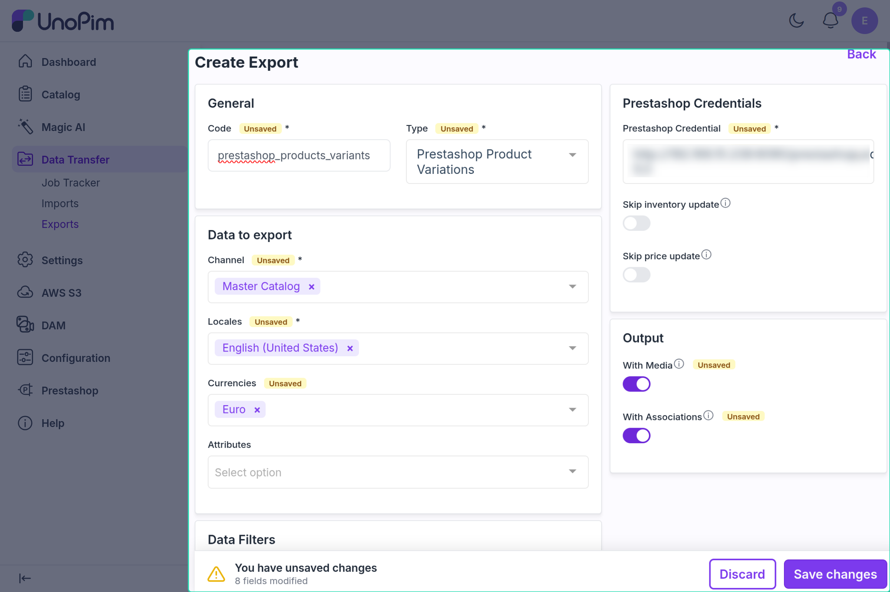

# Product Variant Export

The product variant export job exports UnoPim **variant products** as PrestaShop combinations. It works variant by variant — the filters apply to the variants themselves — and does not re-send the parent product's data.

---

## Configurable Product Export vs Product Variant Export

| | Configurable Product Export | Product Variant Export |
|---|---|---|
| **Loads** | Configurable (parent) products | Variant products |
| **Exports parent product** | Yes — name, price, descriptions, images, categories, features | No — only creates the parent if it is missing in PrestaShop |
| **Exports combinations** | Yes — every variant of each exported parent | Yes — only the variants matched by the filters |
| **Job count** | One per parent product | One per variant |
| **Use when** | First-time sync or parent details changed | Only variants changed (price, stock, options) |

---

## How to Run

1. Go to **Data Transfer → Exports → Create Export**.

2. Select type **Prestashop Product Variants**.

3. Set the filters. They are the same as for [Simple Product Export](./simple-product-export.md#product-export-filters), with these differences:

- **Identifiers**, **Status**, **Attribute Families**, and the other data filters match the **variants** — for example, paste variant SKUs to export only those combinations.
- **Categories** matches the categories of the variant's **parent** product.

4. Save and run the job.

---

## What Gets Exported Per Variant

| Field | Notes |
|---|---|
| **Reference** | The variant's own SKU |
| **Price impact** | Variant price minus parent price |
| **Quantity** | Variant stock |
| **Option values** | e.g. Color: Red, Size: M — from the parent's variant attributes |

Variant images are not exported by this job.

---

## Create vs Update

| Situation | What happens |
|---|---|
| Parent product missing in PrestaShop | Parent is **created first** (logged in the job), then the combination |
| Combination not in PrestaShop | **Created** and linked to the parent |
| Combination already exported | **Updated** |
| Saved combination ID missing in PrestaShop | **Recreated** |

---

## Prerequisites

Option values (e.g. "Red", "M") must exist in PrestaShop before combinations can be created. Run jobs in this order:

1. Attribute Export
2. Category Export
3. Configurable Product Export *(first time)*
4. **Product Variant Export** *(for variant-only updates after that)*

---

## Common Issues

| Issue | Fix |
|---|---|
| Combinations not created | Run **Attribute Export** first so option values exist |
| Variant not exported | It must belong to a configurable parent; check the job log |
| Price impact looks wrong | It is the difference between variant and parent price — check both prices |
| Options not linked | Add the variant attributes in Other Mapping → *Attributes to be used for variant (For Export)* |
