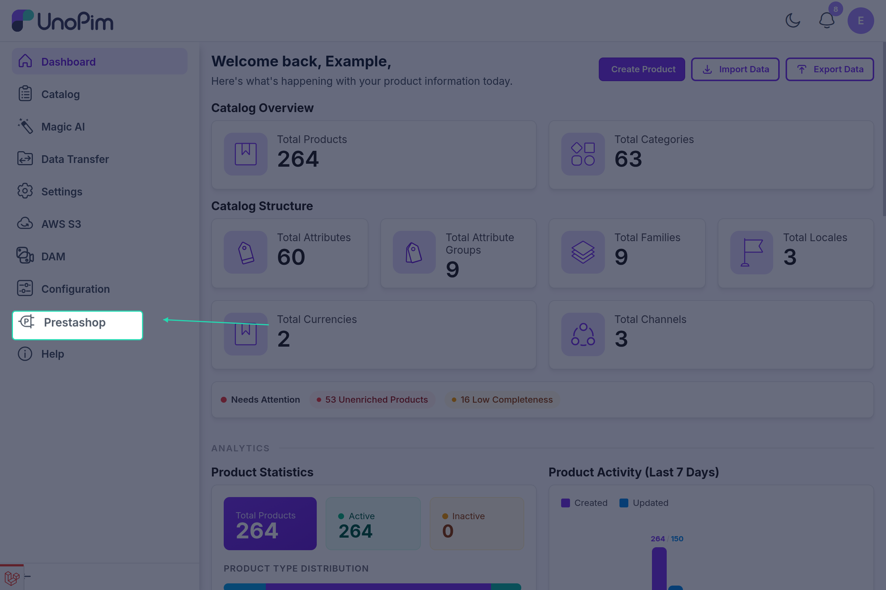
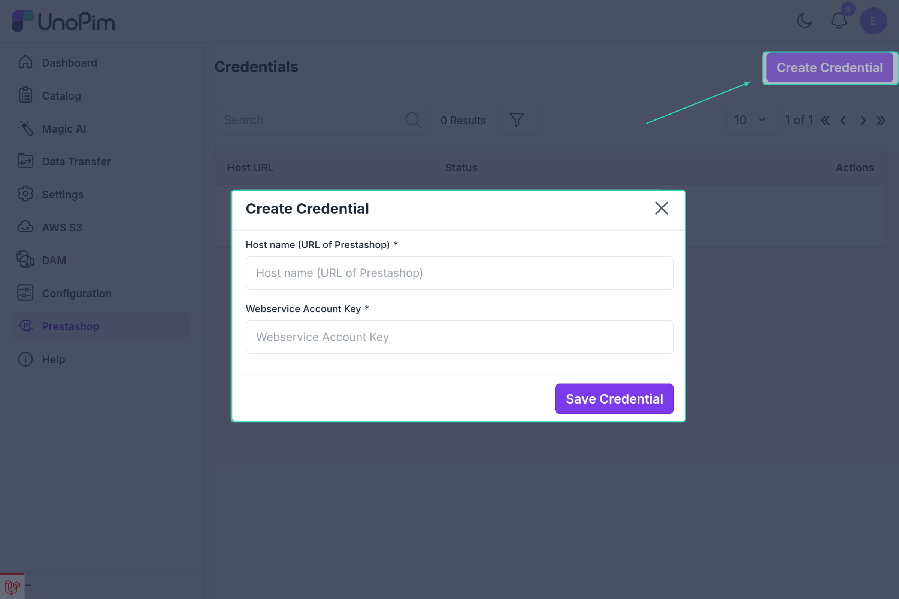
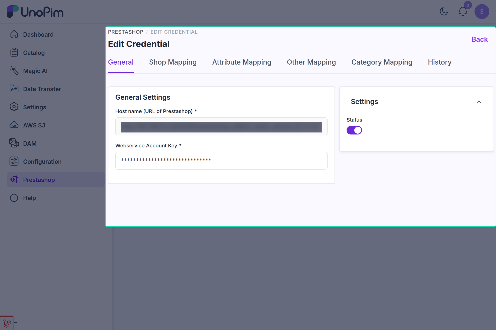

# Configuration Guide — UnoPim PrestaShop Connector

---

## Credentials

Navigate to **Prestashop** in the left sidebar. It opens the **Credentials** list, which shows each credential's **Host URL** and **Status**, with **Edit**, **Delete**, and **History** actions.

### Create a Credential

Click **Create Credential**. A modal opens with two required fields:

| Field | Description |
|---|---|
| **Host name (URL of Prestashop)** | Full URL of your PrestaShop store, e.g. `https://myshop.example.com` |
| **Webservice Account Key** | The API key from PrestaShop **Advanced Parameters → Webservice** (see [PrestaShop Setup](./prestashop-setup.md)) |

Click **Save Credential**. UnoPim tests the connection immediately:

- If another credential already uses the same URL, the form shows *"Credentials already exist for this Host URL"*.
- If the key is wrong or lacks GET permission on `shop_urls`, the error from PrestaShop is shown under the key field, for example *"Check PrestaShop API key permissions, get(view) shop access is not given."*
- On success the credential is saved as **Enabled** and you are taken to its edit page.

---

## Edit a Credential

The **Edit Credential** page is split into tabs:

| Tab | What you configure | Permission needed |
|---|---|---|
| **General** | Webservice key and status | Credentials → Edit |
| **Shop Mapping** | PrestaShop shop → UnoPim channel, currency, and locales — see [Shop & Channel Mapping](./shop-channel-mapping.md) | Credentials → Edit |
| **Attribute Mapping** | PrestaShop product fields → UnoPim attributes — see [Attribute & Other Mapping](./attribute-mapping.md) | Attribute Mapping |
| **Other Mapping** | Images, feature attributes, and variant attributes — see [Attribute & Other Mapping](./attribute-mapping.md) | Attribute Mapping |
| **Category Mapping** | PrestaShop category fields → UnoPim category fields — see [Category Mapping](./category-mapping.md) | Category Mapping |
| **History** | Version log of changes | History |

> Attribute Mapping, Other Mapping, and Category Mapping are shared by all credentials. Changing them on one credential changes them for every credential.

### General

**General Settings** — The **Host name (URL of Prestashop)** cannot be changed after creation. The **Webservice Account Key** is shown masked; leave it masked to keep the current key, or type a new one.

**Settings** — The **Status** switch enables or disables the credential.

When you change the key or status, the connection is tested again before saving.

> A disabled credential is hidden from the **Prestashop Credential** dropdown in jobs, and existing jobs that use it fail validation with *"The Prestashop Credential is not active."*

### Saving Changes

The credential tabs have no separate Save button. As soon as you change a field, a bar appears at the bottom of the page showing **You have unsaved changes** and how many fields are modified, with **Discard** and **Save changes** buttons. Changed fields are marked **Unsaved** until you save.

### History

The **History** tab lists every saved version with **Date / Time**, **Version**, **User**, and **Section**. The section is **Credential** for changes to the General and Shop Mapping tabs, **Mapping** for attribute mapping changes, and **Category Mapping** for category mapping changes. Use **View** to see exactly which values changed.

---

## Permissions

Under **Settings → Roles**, the connector adds a **Prestashop** group:

| Permission | Allows |
|---|---|
| **Credentials** → Create / Edit / Delete | Managing credentials and their Shop Mapping |
| **Attribute Mapping** | The Attribute Mapping and Other Mapping tabs |
| **Category Mapping** | The Category Mapping tab |
