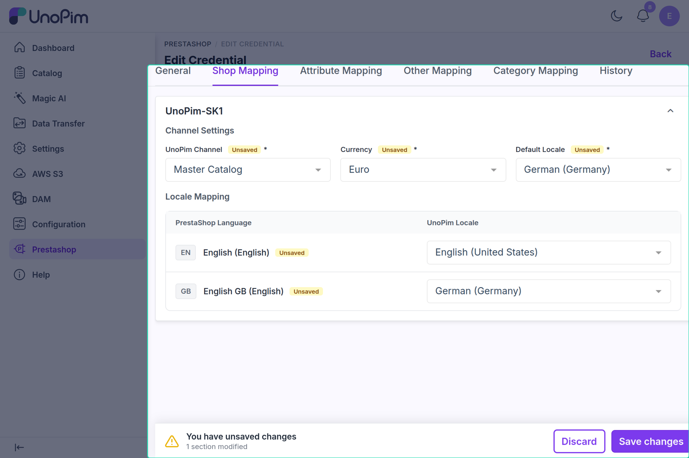

# Shop & Channel Mapping

PrestaShop can run multiple shops from one installation. UnoPim organizes products into **channels**. The Shop Mapping connects each PrestaShop shop to a UnoPim channel so the connector knows which channel, currency, and languages to use for that shop.

---

## How to Set It Up

1. Go to **Prestashop**, open a credential, and select the **Shop Mapping** tab.
2. UnoPim loads your PrestaShop shops and their languages through the API. Each shop is shown as its own collapsible section, titled with the shop name.
3. For each shop, fill in **Channel Settings** and **Locale Mapping** (described below).
4. Click **Save changes** in the bar at the bottom of the page.



If no shops are returned, the tab shows *"No Prestashop Shops Found / Waiting for API..."* — check the host URL and that the key has GET permission on `shop_urls`, `shops`, and `languages`.

---

## What You Configure Per Shop

### Channel Settings

| Field | What it means |
|---|---|
| **UnoPim Channel** | Which UnoPim channel feeds this shop |
| **Currency** | The currency for this shop — only the selected channel's currencies are listed |
| **Default Locale** | The primary language for this shop — only the selected channel's locales are listed |

**Currency** and **Default Locale** stay disabled until a channel is selected. Changing the channel clears Currency, Default Locale, and every locale row for that shop, so they must be selected again.

### Locale Mapping

A table with one row per PrestaShop language of the shop. Each row shows the language's ISO code and name under **PrestaShop Language**, and a required **UnoPim Locale** select, listing the selected channel's locales.

All fields are required.

---

## How It Works During Export / Import

Jobs do not pick a shop directly. In an export or import job you pick a **Channel**; the connector:

1. Finds every shop mapped to that channel in the credential.
2. Uses each shop's currency, default locale, and language mapping.
3. Keeps only the locales you selected in the job.
4. Sends or reads localized values using the PrestaShop language IDs mapped to those UnoPim locales.

Only channels that are mapped here appear in the **Channel** filter of export jobs, and only the locales mapped for that channel appear in **Locales**.

---

## Example Mapping

```
Shop 1 (Default Shop)
  UnoPim Channel → default
  Currency       → US Dollar
  Default Locale → English (United States)
  EN English     → English (United States)
  FR Français    → French (France)

Shop 2 (European Store)
  UnoPim Channel → europe
  Currency       → Euro
  Default Locale → French (France)
  EN English     → English (United Kingdom)
  FR Français    → French (France)
```

---

## Common Errors

| Error | Fix |
|---|---|
| *"Please map atleast one channel with a shop."* | Select a UnoPim Channel for at least one shop |
| *"Please select currency for the selected channel"* | Select a Currency for every mapped shop |
| *"Please select default locale for the selected channel"* | Select a Default Locale for every mapped shop |
| *"Please map all locale for the selected channel"* | Map every PrestaShop language row to a UnoPim locale |
| *"No shops are mapped in the Prestashop credential…"* (job log) | Complete the Shop Mapping tab and save |
| *"Selected locales are not available for the chosen channel."* | In the job, choose locales that belong to the selected channel |
