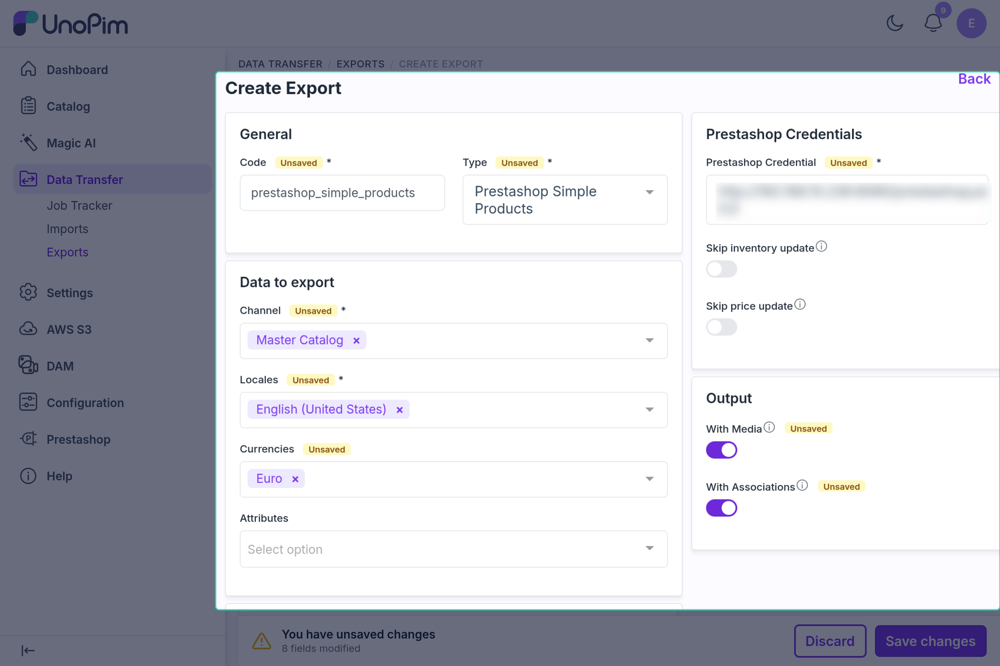

# Simple Product Export

The simple product export job pushes UnoPim simple products (without a parent) to PrestaShop. Each product is created or updated through the PrestaShop WebService API.

---

## Before You Start

- Complete the credential's [Shop Mapping](./shop-channel-mapping.md).
- Map **Name** and **Price** (an attribute or a default value) in the [Attribute Mapping](./attribute-mapping.md) tab. Without them the job cannot be saved: *"The Attribute Mappings are not set. Please map the attributes in the Attribute Mapping tab of the credential first."*
- Run [Category Export](./category-export.md) and [Attribute Export](./attribute-export.md) first, so categories and features exist in PrestaShop.

---

## How to Run

1. Go to **Data Transfer → Exports → Create Export**.

2. Select type **Prestashop Simple Products**.

3. Set the filters (described below).

4. Save and run the job.

---

## Product Export Filters

These filters are the same for the simple, configurable, and variant product export jobs.

### Prestashop Credentials

| Field | What it does |
|---|---|
| **Prestashop Credential** | Your PrestaShop connection — required. Only enabled credentials are listed |
| **Skip inventory update** | Leaves the stock of products already in PrestaShop unchanged. New products still get their quantity |
| **Skip price update** | Leaves the price of products already in PrestaShop unchanged. New products still get their price |

### Data to export

| Field | What it does |
|---|---|
| **Channel** | One or more channels mapped in the credential's Shop Mapping — required |
| **Locales** | Locales to export, from those mapped for the selected channel — required |
| **Currencies** | Optional. Lists the currencies of the shops mapped to the selected channels; shops whose currency is not selected are skipped |
| **Attributes** | Optional. Export only these mapped attributes. Required fields are still sent for new products |

### Data Filters

| Field | What it does |
|---|---|
| **Attribute Families** | Only products in these families |
| **Status** | Enable, Disable, or All |
| **Completeness** | No condition, complete on at least one selected locale, or complete on all selected locales |
| **Time Condition** | No date condition, updated over the last N days, updated since last export, or updated between two dates |
| **Categories** | Only products in the selected categories |
| **Identifiers** | Paste one SKU per line to export only those products |

**Attribute Conditions** — optional rules on attribute values; only products matching every condition are exported.

### Output

| Field | What it does |
|---|---|
| **With Media** | Upload product images and attachments to PrestaShop. Off by default |
| **With Associations** | Send related, up-sell, and cross-sell products as PrestaShop accessories. Targets not yet exported are skipped. Off by default |

---

## What Gets Exported

| Field | Notes |
|---|---|
| **Name, Description, Short Description** | Localized per mapped language |
| **Meta Title, Meta Description, Link Rewrite** | Localized; Link Rewrite is generated from the name if not mapped |
| **Price** | Required — the product is skipped if it has no price |
| **Reference** | The product SKU, unless **Reference** is mapped |
| **Ean13, Upc, Weight, Visibility, Active, Tax rules group** | If mapped or given a default value |
| **Quantity** | Sent as the product's stock |
| **Categories** | Linked to categories already exported to PrestaShop; Home is used if none are found |
| **Features** | Values of the feature attributes from the Other Mapping tab |
| **Images and attachments** | With **With Media** on — the main and additional images from Images Mapping; other files become PrestaShop attachments |
| **Accessories** | With **With Associations** on |

Only mapped fields and default values are sent; no other attributes are exported. See [Attribute Mapping](./attribute-mapping.md) for the list of fields sent.

---

## Create vs Update

| Situation | What happens |
|---|---|
| Product exported before | **Updated** using the saved PrestaShop ID |
| Not exported before, but a PrestaShop product has the same reference (SKU) | That product is **updated** and linked |
| No match found | **Created**; its ID is saved |
| Saved ID no longer exists in PrestaShop | **Recreated** |

With several shops mapped to the selected channel, the product is created in the first shop and then updated for each other shop with that shop's languages.

---

## Images

With **With Media** on, images are uploaded after the product is saved:

- The main image and additional images come from **Other Mapping → Images Mapping**.
- Images removed in UnoPim are deleted from PrestaShop on the next export.

---

## Common Issues

| Issue | Fix |
|---|---|
| Job cannot be saved — *"The Attribute Mappings are not set…"* | Map **Name** and **Price** in Attribute Mapping |
| Product skipped — *"Product price is required field."* | Give the product a price, or set a Price default value |
| Categories not linked | Run **Category Export** first |
| Features missing | Run **Attribute Export** first |
| Images not uploading | Turn on **With Media** and add an image attribute in Images Mapping |
| Names blank in PrestaShop | Make sure the selected locales have values in UnoPim |
